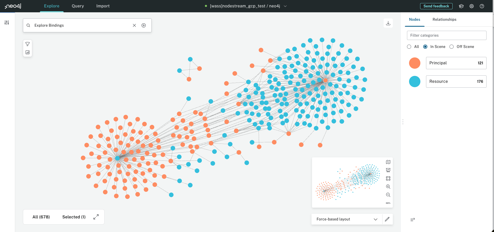

# Nodestream Google Cloud Asset Inventory Plugin

This repo contains a [Nodestream](https://nodestream-proj.github.io/docs/docs/intro/) plugin to import Cloud Assets and Policies from GCP Asset Inventory into a graph database. Nodestream is a declarative framework for Building, Maintaining, and Anaylzing Data in a Graph Database.

## Features 

- Automated download of Asset and Policy data from [GCP Asset Inventory](https://cloud.google.com/asset-inventory/docs/overview) and import into a graph database
- Graph data model supports exploration and analysis of GCP Resources

## Getting Started

## Setup Neo4j 
- You can create an Aura instance [here](https://console.neo4j.io) or, 
- You can run Neo4j in a docker container like this: 
```
docker run \
    --restart always \
    --publish=7474:7474 --publish=7687:7687 \
    --env NEO4J_PLUGINS='["apoc"]' \
    neo4j:5
```
- Initial credentials are username: neo4j, password: neo4j 

## Authenticate to GCP 
- Follow documentation [here](https://cloud.google.com/docs/authentication/provide-credentials-adc) to authenticate to Google Cloud

## Install Nodestream 
- ``` pip install nodestream```

## Install Nodestream Plugins
- ``` pip install nodestream-plugin-neo4j```
- ``` pip install nodestream-plugin-gcp-asset-inventory```

## Configure Nodestream  
- Add the following to nodestream.yaml
```
plugins:
- name: gcp_asset_inventory
  config:
    project_id: <insert your GCP project ID>

targets:
  my-db:
    database: neo4j
    uri: bolt://localhost:7687
    username: neo4j
    password: yourPassword
```

## Preparing the database with Nodestream Migrations 
- ```nodestream migrations make``` 

- ```nodestream migrations run --target my-db```


## Run the Pipelines

- ```nodestream run gcpAsset --target my-db```

- ```nodestream run gcpPolicy --target my-db```


## Visualize and Explore your Asset Network 

Explore in [Neo4j Aura](https://console.neo4j.io) allows you to easily explore the Asset graph you just built. 

